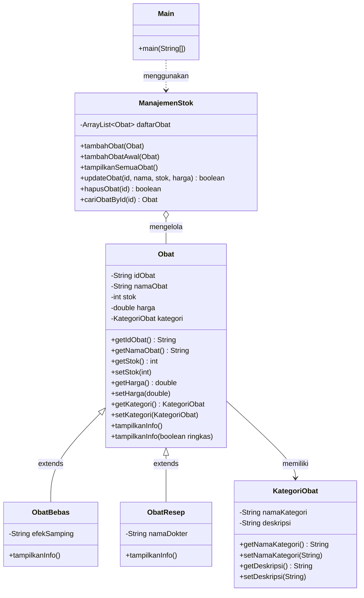

# Sistem Manajemen Stok Obat Apotek

Program console berbasis Java untuk mengelola stok obat apotek menggunakan konsep **Pemrograman Berorientasi Objek (PBO)**.

---

## 1. Identitas Mahasiswa

| Keterangan | Data |
|------------|------|
| Nama | Muhammad Ihsan Kamil |
| NIM | 2509116035 |
| Kelas | A 2025 |
| Mata Kuliah | Pemrograman Berorientasi Objek |

---

## 2. Studi Kasus yang Dipilih

**Studi kasus: Manajemen Stok Obat pada Apotek.**

Apotek perlu mencatat obat yang tersedia beserta stok dan harganya. Obat tidak semuanya sama, sehingga dibedakan menjadi dua jenis:

| Jenis Obat | Ciri | Data Khusus yang Disimpan |
|------------|------|---------------------------|
| **Obat Bebas** | Dapat dibeli tanpa resep | Efek samping |
| **Obat Resep (Obat Keras)** | Harus dengan resep dokter | Nama dokter |

Kedua jenis obat punya data dasar yang sama (ID, nama, stok, harga, kategori), tetapi berbeda pada data khususnya. Kondisi inilah yang cocok diselesaikan dengan **inheritance**: data yang sama ditaruh di satu *superclass*, data yang berbeda ditaruh di *subclass* masing-masing.

### Fitur Program (CRUD)

| Menu | Fitur | Keterangan |
|------|-------|------------|
| 1 | Tampilkan Semua Obat | Read – menampilkan data dalam bentuk tabel |
| 2 | Tambah Obat Baru | Create – menambah obat bebas atau obat resep |
| 3 | Ubah Data Obat | Update – mengubah nama, stok, dan harga berdasarkan ID |
| 4 | Hapus Obat | Delete – menghapus obat berdasarkan ID |
| 5 | Keluar | Menghentikan program |

Saat program dijalankan, sudah tersedia **2 data awal (dummy)** yang dimasukkan lewat `tambahObatAwal()` (tanpa pesan konfirmasi, berbeda dengan `tambahObat()` biasa yang mencetak "Data obat berhasil ditambahkan!"):

| ID | Nama | Jenis | Stok | Harga | Keterangan |
|----|------|-------|------|-------|------------|
| OBT01 | Paracetamol | ObatBebas | 50 | Rp 5.000 | Efek: Mengantuk |
| OBT02 | Amoxicillin | ObatResep | 20 | Rp 12.000 | Dokter: dr. Rizki |

---

## 3. Diagram Kelas dan Hierarki Class

### 3.1 Struktur File

Seluruh file berada dalam satu package `SistemManajemenObat`:

```
SistemManajemenObat/
├── Main.java            → menu & input pengguna
├── ManajemenStok.java   → operasi CRUD pada ArrayList<Obat>
├── Obat.java            → SUPERCLASS
├── ObatBebas.java       → SUBCLASS (extends Obat)
├── ObatResep.java       → SUBCLASS (extends Obat)
└── KategoriObat.java    → data kategori (dipakai oleh Obat)
```

### 3.2 Diagram Kelas



### 3.3 Penjelasan Hierarki

```
              Obat  (Superclass)
        idObat, namaObat, stok, harga, kategori
                     │
         ┌───────────┴───────────┐
         │                       │
     ObatBebas               ObatResep
  (+ efekSamping)          (+ namaDokter)
     Subclass 1              Subclass 2
```

| Class | Peran | Keterangan |
|-------|-------|------------|
| `Obat` | Superclass | Menyimpan atribut dan perilaku yang dimiliki semua obat |
| `ObatBebas` | Subclass | Mewarisi `Obat`, menambah atribut `efekSamping` |
| `ObatResep` | Subclass | Mewarisi `Obat`, menambah atribut `namaDokter` |
| `KategoriObat` | Class pendukung | Dipakai `Obat` sebagai atribut (hubungan *has-a*, bukan inheritance) |
| `ManajemenStok` | Class pengelola | Menyimpan `ArrayList<Obat>` dan menyediakan operasi CRUD |
| `Main` | Class utama | Menampilkan menu dan membaca input pengguna |

---

## 4. Penjelasan Kode yang Menerapkan Inheritance

### 4.1 Superclass: `Obat`

File `Obat.java` berisi atribut yang dimiliki semua jenis obat:

```java
public class Obat {
    private String idObat;
    private String namaObat;
    private int stok;
    private double harga;
    private KategoriObat kategori;

    public Obat(String idObat, String namaObat, int stok, double harga, KategoriObat kategori) {
        this.idObat = idObat;
        this.namaObat = namaObat;
        this.stok = stok;
        this.harga = harga;
        this.kategori = kategori;
    }
    ...
    public void tampilkanInfo() {
        System.out.printf("| %-8s | %-18s | %-15s | %-6d | Rp %-10.2f |",
                idObat, namaObat, kategori.getNamaKategori(), stok, harga);
    }
}
```

### 4.2 Subclass 1: `ObatBebas`

```java
public class ObatBebas extends Obat {          // (1) pewarisan dengan 'extends'
    private String efekSamping;                // (2) atribut khusus subclass

    public ObatBebas(String idObat, String namaObat, int stok, double harga,
                      KategoriObat kategori, String efekSamping) {
        super(idObat, namaObat, stok, harga, kategori);   // (3) memanggil constructor superclass
        this.efekSamping = efekSamping;
    }

    @Override
    public void tampilkanInfo() {              // (4) method overriding
        super.tampilkanInfo();                 // (5) memakai method milik superclass
        System.out.printf(" %-22s |\n", "Efek: " + efekSamping);
    }
}
```

### 4.3 Subclass 2: `ObatResep`

```java
public class ObatResep extends Obat {          // (1) pewarisan dengan 'extends'
    private String namaDokter;                 // (2) atribut khusus subclass

    public ObatResep(String idObat, String namaObat, int stok, double harga,
                      KategoriObat kategori, String namaDokter) {
        super(idObat, namaObat, stok, harga, kategori);   // (3) memanggil constructor superclass
        this.namaDokter = namaDokter;
    }

    @Override
    public void tampilkanInfo() {              // (4) method overriding
        super.tampilkanInfo();                 // (5) memakai method milik superclass
        System.out.printf(" %-22s |\n", "Dokter: " + namaDokter);
    }
}
```

### 4.4 Keterangan Poin Inheritance

| No | Kode | Penjelasan |
|----|------|------------|
| 1 | `extends Obat` | Menyatakan bahwa `ObatBebas` dan `ObatResep` adalah turunan `Obat`, sehingga otomatis memiliki atribut dan method milik `Obat` (ID, nama, stok, harga, kategori, getter/setter). |
| 2 | `private String efekSamping` / `namaDokter` | Atribut yang hanya ada di masing-masing subclass, sehingga tidak perlu dimasukkan ke `Obat`. |
| 3 | `super(idObat, namaObat, stok, harga, kategori)` | Meneruskan data umum ke constructor `Obat` supaya tidak perlu menulis ulang proses pengisian atribut. |
| 4 | `@Override tampilkanInfo()` | Subclass menimpa method milik superclass untuk menambahkan kolom keterangan khusus. |
| 5 | `super.tampilkanInfo()` | Memanggil versi method di `Obat` (mencetak ID, nama, kategori, stok, harga) lalu subclass melanjutkan dengan kolom miliknya. |

### 4.5 Inheritance saat Program Berjalan

Pada `ManajemenStok.java`, satu `ArrayList<Obat>` bisa menampung kedua jenis obat sekaligus:

```java
private ArrayList<Obat> daftarObat = new ArrayList<>();
...
for (Obat o : daftarObat) {
    o.tampilkanInfo();
}
```

Variabel `o` bertipe `Obat`, tetapi Java otomatis menjalankan `tampilkanInfo()` milik `ObatBebas` (tampil `Efek: ...`) atau `ObatResep` (tampil `Dokter: ...`) sesuai objek yang sebenarnya. Ini adalah bentuk **polymorphism runtime** — dijelaskan lebih detail di bagian 5.

Pembuatan objek di `Main.java`:

```java
Obat ob1 = new ObatBebas("OBT01", "Paracetamol", 50, 5000, bebas, "Mengantuk");
Obat ob2 = new ObatResep("OBT02", "Amoxicillin", 20, 12000, keras, "dr. Rizki");
```

Objek subclass dapat disimpan dalam variabel bertipe superclass (`Obat`) karena `ObatBebas` dan `ObatResep` *adalah sebuah* `Obat`.

---

## 5. Penjelasan Kode yang Menerapkan Polymorphism

Polymorphism diterapkan dengan dua cara: **method overriding** dan **method overloading**.

### 5.1 Method Overriding

`ObatBebas` dan `ObatResep` sama-sama meng-override method `tampilkanInfo()` milik `Obat` (lihat kode di bagian 4.2 dan 4.3). Bukti bahwa ini benar-benar polymorphism runtime terlihat di `ManajemenStok.tampilkanSemuaObat()`:

```java
for (Obat o : daftarObat) {
    o.tampilkanInfo();
}
```

Satu baris kode yang sama menghasilkan output berbeda tergantung objek asli di dalam `daftarObat` — inilah **runtime polymorphism**: keputusan method mana yang dijalankan (`Obat`, `ObatBebas`, atau `ObatResep`) baru ditentukan saat program berjalan, bukan saat kompilasi.

### 5.2 Method Overloading

Kelas `Obat` memiliki dua method dengan nama sama, `tampilkanInfo()`, tetapi parameter berbeda:

```java
// Versi 1: tanpa parameter — tampilan lengkap
public void tampilkanInfo() {
    System.out.printf("| %-8s | %-18s | %-15s | %-6d | Rp %-10.2f |",
            idObat, namaObat, kategori.getNamaKategori(), stok, harga);
}

// Versi 2: dengan parameter boolean — tampilan ringkas (Method Overloading)
public void tampilkanInfo(boolean ringkas){
    if (ringkas) {
        System.out.println(namaObat + " [" + idObat + "]");
    } else {
        tampilkanInfo();
    }
}
```

Ini disebut overloading karena nama method sama tapi *signature*-nya berbeda (jumlah/tipe parameter berbeda), dan compiler yang menentukan versi mana yang dipanggil berdasarkan argumen yang diberikan (**compile-time polymorphism**).

Dipanggil di `ManajemenStok.tampilkanSemuaObat()`:

```java
for (Obat o : daftarObat) {
    o.tampilkanInfo();          // memanggil versi tanpa parameter (lengkap)
}
...
for (Obat o : daftarObat) {
    o.tampilkanInfo(true);      // memanggil versi dengan parameter (ringkas)
}
```

### 5.3 Ringkasan Perbedaan

| Jenis Polymorphism | Contoh di Program | Ditentukan Kapan |
|---|---|---|
| Overriding | `tampilkanInfo()` di `ObatBebas` & `ObatResep` menimpa versi di `Obat` | Saat program berjalan (runtime) |
| Overloading | `tampilkanInfo()` vs `tampilkanInfo(boolean ringkas)` di `Obat` | Saat kompilasi (compile-time) |

> **Catatan jujur:** overloading di atas valid secara konsep, tapi penggunaannya di `tampilkanSemuaObat()` agak dipaksakan karena kedua versi selalu dipanggil sekaligus, bukan dipilih salah satu berdasarkan kebutuhan pengguna. Kalau ditanya penguji "kenapa perlu dua-duanya ditampilkan?", jawaban paling aman adalah menjelaskan versi ringkas sebagai daftar cepat ID+nama di akhir laporan, terpisah dari tabel detail di atasnya.

---

## 6. Penjelasan Kode yang Menerapkan Condition (If-Else)

### 6.1 Pemilihan Kategori Obat saat Input (Menu 2)

```java
if (katPilih.equals("1")) {
    System.out.print("Masukkan Efek Samping: ");
    String efekSamping = scanner.nextLine().trim();
    app.tambahObat(new ObatBebas(id, nama, stok, harga, bebas, efekSamping));
} else if (katPilih.equals("2")) {
    System.out.print("Masukkan Nama Dokter: ");
    String namaDokter = scanner.nextLine().trim();
    app.tambahObat(new ObatResep(id, nama, stok, harga, keras, namaDokter));
} else {
    System.out.println("Pilihan kategori tidak valid! Batal menambahkan data.");
}
```

`if-else` di sini menentukan subclass mana (`ObatBebas` atau `ObatResep`) yang akan dibuat, sekaligus atribut tambahan apa yang perlu diminta dari pengguna.

### 6.2 Pengecekan Hasil Pencarian (Menu 3 dan Menu 4)

```java
if (app.cariObatById(idUpdate) != null) {
    ...
} else {
    System.out.println("ID Obat tidak ditemukan!");
}
```

```java
if (app.hapusObat(idHapus)) {
    System.out.println("Obat berhasil dihapus!");
} else {
    System.out.println("ID Obat tidak ditemukan!");
}
```

`if-else` di sini mencegah program mengubah/menghapus data yang ID-nya tidak ada di `daftarObat`.

### 6.3 Switch-Case sebagai Percabangan Menu

```java
switch (pilihan) {
    case "1": app.tampilkanSemuaObat(); break;
    case "2": /* ... */ break;
    case "3": /* ... */ break;
    case "4": /* ... */ break;
    case "5": running = false; break;
    default: System.out.println("Input wajib diantara 1-5!");
}
```

`switch-case` adalah bentuk lain dari percabangan kondisi (setara dengan rangkaian `if-else if`), digunakan untuk mengarahkan alur program sesuai menu yang dipilih pengguna.

### 6.4 Validasi Input dengan Try-Catch

```java
private static int inputInt(Scanner scanner, String prompt) {
    while (true) {
        System.out.print(prompt);
        String raw = scanner.nextLine().trim();
        try {
            return Integer.parseInt(raw);
        } catch (NumberFormatException e) {
            System.out.println("Input salah! Masukkan angka bulat.");
        }
    }
}
```

Meski bukan `if-else` murni, `try-catch` berfungsi sebagai kondisi: jika input **bisa** diubah menjadi angka, program lanjut; jika **tidak bisa**, program menangani error dan meminta input ulang.

---

## 7. Penjelasan Kode yang Menerapkan Looping

### 7.1 Loop Menu Utama (`while`)

```java
boolean running = true;
while (running) {
    System.out.println("\n=== SISTEM MANAJEMEN STOK OBAT APOTEK ===");
    ...
    switch (pilihan) {
        case "5":
            running = false;
            System.out.println("Terima kasih telah menggunakan sistem ini.");
            break;
    }
}
```

Loop `while (running)` membuat menu terus muncul berulang sampai pengguna memilih menu "5. Keluar", yang mengubah `running` menjadi `false` dan menghentikan perulangan.

### 7.2 Loop Validasi Input (`while (true)`)

```java
private static double inputDouble(Scanner scanner, String prompt) {
    while (true) {
        System.out.print(prompt);
        String raw = scanner.nextLine().trim();
        try {
            return Double.parseDouble(raw);
        } catch (NumberFormatException e) {
            System.out.println("Input salah! Masukkan angka desimal/bulat.");
        }
    }
}
```

Loop ini terus meminta input sampai pengguna memasukkan angka yang valid; method baru berhenti melalui `return` di dalam `try`.

### 7.3 Loop `for-each` untuk Menampilkan dan Mencari Data

```java
for (Obat o : daftarObat) {
    o.tampilkanInfo();
}
...
for (Obat o : daftarObat) {
    o.tampilkanInfo(true);
}
```

Loop `for-each` di `ManajemenStok.tampilkanSemuaObat()` digunakan untuk mengiterasi seluruh `ArrayList<Obat>` dan mencetak tiap objeknya, sedangkan di `cariObatById()` digunakan untuk mencari objek berdasarkan ID:

```java
public Obat cariObatById(String id) {
    for (Obat o : daftarObat) {
        if (o.getIdObat().equalsIgnoreCase(id)) {
            return o;
        }
    }
    return null;
}
```

---

## 8. Alur Program & Cara Menjalankan

1. **Inisialisasi** — Saat program dijalankan, dua data obat contoh (Paracetamol dan Amoxicillin) otomatis dimasukkan ke sistem melalui `tambahObatAwal()`.
2. **Kompilasi dan Jalankan**
   ```bash
   javac SistemManajemenObat/*.java
   java SistemManajemenObat.Main
   ```
3. **Menu Utama** — Program menampilkan menu pilihan yang terus berulang sampai pengguna memilih keluar:
   ```
   1. Tampilkan Semua Obat (Read)
   2. Tambah Obat Baru (Create)
   3. Ubah Data Obat (Update)
   4. Hapus Obat (Delete)
   5. Keluar
   ```
4. **Penjelasan Tiap Menu**
   - **Menu 1 (Read)** — Menampilkan seluruh data obat dalam bentuk tabel, memanggil `tampilkanInfo()` pada setiap objek `Obat` (polymorphism: masing-masing subclass menampilkan info sesuai tipenya), lalu menampilkan ulang daftar ringkas dengan `tampilkanInfo(true)`.
   - **Menu 2 (Create)** — Meminta input ID, nama, stok, dan harga obat, lalu meminta pengguna memilih kategori (1 = Obat Bebas, 2 = Obat Resep) menggunakan `if-else`. Berdasarkan pilihan, sistem membuat objek `ObatBebas` atau `ObatResep`.
   - **Menu 3 (Update)** — Mencari obat berdasarkan ID (`cariObatById`), lalu memperbarui nama, stok, dan harga.
   - **Menu 4 (Delete)** — Menghapus data obat berdasarkan ID.
   - **Menu 5 (Keluar)** — Menghentikan loop utama dan menutup program.
5. **Validasi Input** — Input angka (stok dan harga) divalidasi menggunakan `try-catch` pada method `inputInt()` dan `inputDouble()`; jika input tidak valid, pengguna diminta memasukkan ulang dalam loop `while (true)`.

---

## 9. Tangkapan Layar Program

Berikut dokumentasi hasil eksekusi Program Sistem Manajemen Obat pada Apotek.

### 9.1 Program Pertama Kali Dijalankan (Menu Utama)

Menampilkan menu 1–5 saat program dijalankan.


### 9.2 Menu 1 – Tampilkan Semua Obat

Menampilkan tabel lengkap (hasil `tampilkanInfo()`) diikuti daftar ringkas (hasil `tampilkanInfo(true)`) — membuktikan overloading berjalan.


### 9.3 Menu 2 – Tambah Obat Bebas

Memilih kategori `1`, lalu mengisi efek samping — objek `ObatBebas` dibuat sesuai percabangan `if`.


### 9.4 Menu 2 – Tambah Obat Resep

Memilih kategori `2`, lalu mengisi nama dokter — objek `ObatResep` dibuat sesuai percabangan `else if`.


### 9.5 Menu 3 – Ubah Data Obat

Mengubah nama, stok, dan harga obat berdasarkan ID yang dicari lewat `cariObatById()`.


### 9.6 Menu 4 – Hapus Obat

Menghapus obat berdasarkan ID, lalu menampilkan ulang daftar dengan menu 1 untuk memverifikasi data sudah terhapus.


### 9.7 Menu 5 – Keluar

Program menghentikan loop `while (running)` dan menampilkan pesan penutup.


---

<p align="center">Dibuat oleh <b>Muhammad Ihsan Kamil</b> – Pemrograman Berorientasi Objek</p>
